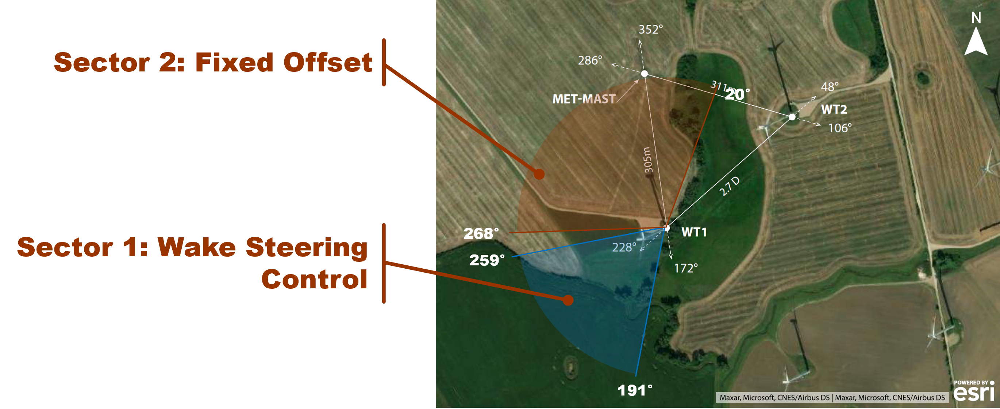
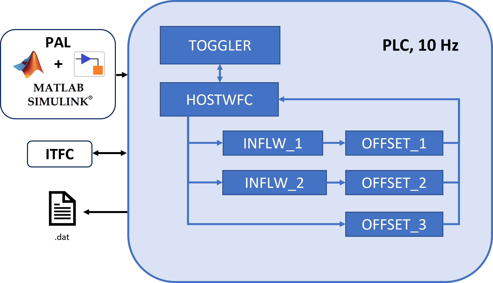

# A framework for the coordination of Wake Steering strategies

## Table of Contents

- [A framework for the coordination of Wake Steering strategies](#a-framework-for-the-coordination-of-Wake-Steering-strategies)
  - [Table of Contents](#table-of-contents)
  - [Introduction](#introduction)
  - [How to use this repository](#How-to-use-this-repository)
    - [Prerequisites](#prerequisites)
    - [Installation](#installation)
  - [Usage](#usage)
    - [General Framework Architecture](#General-Framework-Architecture)
    - [Wake Steering Application](#Wake-Steering-Application)
  - [License](#license)
  - [Acknowledgments](#acknowledgments)

## Introduction

The present repository contains a Simulink-based framework for the execution, monitoring and coordination of wake steering strategies on a single wind turbine. This framework, generalized to exclude any confidential information, was used to coordinate two different sets of experiments. The first aimed at wind power maximization through wake steering, and the second aimed at applying fixed offsets to a wind turbine to characterize its wake through LiDARs. The experiments were conducted jointly by the Lehrstuhl für Windenergie of the Technische Universität München and by the ForWind – Center for Wind Energy Research of the University of Oldenburg. The experimental test site is located in the north of Germany, and is composed of two-wind turbines. An aerial view of the test site is provided [below](./docs/overview_testsite.png)

Wind turbine orientation was controlled through a programmable logic computer (PLC) installed at the base of WT1. During the experiment, wind direction and speed was measured through a met-mast installed approximately 300m north of the turbine. This inflow was used to determine the wind direction sector, which was used to assess which offset to provide as an additional input to the wind vane sensor installed on the turbine nacelle, which was therefore fed to the wind turbine controller.

## Getting Started:

### Prerequisites:
### Installation:

This repository is an extension of the framework for development, deployment and testing of interconnected PLC applications PAL (insert link). This repository contains a set of files and simulink models, which constitute PAL inputs that can be used to deploy a toggler for coordinating different wake steering strategies. For details on PAL setup, model development and how to develop a new project, please refer to the respective documentation. This repository should be placed as a submodule of PAL, which should be added in the \Examples folder of PAL.

## Usage

### General Framework Architecture
------------------------------------

Following the three layered approach of PAL, three layers have been included in the present framework for wind farm control, ITFC, HOST and SUBMODEL apps. In the experiment, the framework run on a Bachmann plc

An ITFC app, which during the experiments was developed by the wind turbine manufacturer, provided of all necessary data and the connection to the turbine controller was performed by the operator (who developed the "ITFC" app). This includes SCADA data, which were used to monitor the status of the turbines, but also data from a met-mast, which was located in the proximity of the turbines and was used to assess the inflow. The sampling frequency of the PLC system was 10 Hz. 

A HOST model is tasked with activities such as reading and writing data to and from ITFC applications, as well as hosting data for SUBMODEL access (both read and write), as well as generating the output .txt files.

As described in details in the PAL - User Manual (insert link), SUBMODEL applications perform all the higher level tasks, and are provided in the form of Simulink models. 

Mention the different inputfiles

### Wake Steering Application

An overview of the SUBMODELS that compose the present framework are shown in the following [figure](./docs/wfc_framework_apps.png). A description of each application type is provided below:

**INFLW**

INFLW blocks perform the task of determining inflow conditions from available inflow measurements, in order to feed them as input for LUT interpolation present in a **OFFSET** block. Two identical Simulink models and **init_** files are provided in the present case for both **INFLW** blocks, but in principle they could be different, to accommodate different design choice of different wake steering strategies. 

In the present example, wind speed inflow is read at two different heights (116.3 and 54.2m), and is used to calculate averaged wind speeds, turbulence intensity and the shear exponent. Wind direction is also provided and averaged. Different moving averagings can be selected for each inflow quantity through the **init_** file. The Simulink model also performs additional checks and the inputs and flags errors if signals are frozen of NaN. The status of the INFLW block i.e. the availability of outputs signals is encoded as a 4 bit signal, which is then converted to integer and provided as an additional output of the model through the variable "output_InflowOK".

**OFFSET**

OFFSET blocks calculate the offsets, which are then fed to the TOGGLER app. 

In the present example, three OFFSET blocks are included. Just as **INFLW**, OFFSET_1 and OFFSET_2 are identical and read inputs from INFLW_1 and INFLW_2, respectively. These very simple Simulink models interpolate sample 4-dimensional LUT. These two offsets are toggled together with a Greedy offset within "Sector 1". OFFSET_3 provides a Simulink model which can be used for fixed offset calculation. This model does not require inputs. Generally speaking, it is not necessary to separate **INFLW** from **OFFSET**, which was done here to increase modularity.

**TOGGLER**

The main supervision task is performed by the "TOGGLER" application, which performs important tasks such as determining which strategy offset should be fed to the HOST (and therefore, to the turbine controller), according to a user-defined sequence. The "TOGGLER" also ensures that WFC is active only within prescribed inflow conditions. A thorough description of the wake steering applications will be provided in the full paper version. A schematics of the TOGGLER application is shown [below](./docs/wfc_framework_apps.png)

Generally speaking, the TOGGLER block read its inputs from HOST (like any other application). Information about the inflow characteristics are used to assess which wind direction sector is active and, if so, whether wind conditions are suitable for offset provision. Furthermore, the wind turbine operational status is used to ensure the turbine is in power production. A WFC_status monitors the status of the operations, similarly to the variable "output_InflowOK" of the **INFLW** blocks. 

Simultaneously, a check is performed to verify the availability of the other applications within the PLC, through the status variables of the other SUBMODELS (see PAL documentation for details). This ensures that offset is selected only from active strategies. Manual toggling of strategies is also provided. A further histeresis block is added to prevent rapid switching on and off of the framework (for examples when operating close to the wind directions or wind speed boundaries).

Toggling is performed on all available strategies of the active sector, on a user-defined time interval (in the present example set to 35 minutes). It is worth reminding that in the Simulink model included, an additional non-controlled "Greedy" was included as a reference, whose offset was set to zero.

Additional time-management functionalities are included to prioritize strategies that have been run less time than others, and can be activated and defined through the relative **init** file.

Offsets from all the **OFFSET** applications are provided as inputs to the **TOGGLER** application. The appropriate strategy is selected from all the available offsets based on the above mentioned checks. 

The demanded offset can be further passed through a "Saturation block" (a "dummy" version is included in the present example), which can be used to perform additional processing on the signal. During the experiments of CompactWind2, for example, this block was built based on the wind turbine yaw controller to prevent involuntary shutdown during sudden switch of wake steering strategy. Clipping of the yaw offset according to manufacturer requirements can also be applied, if necessary.

