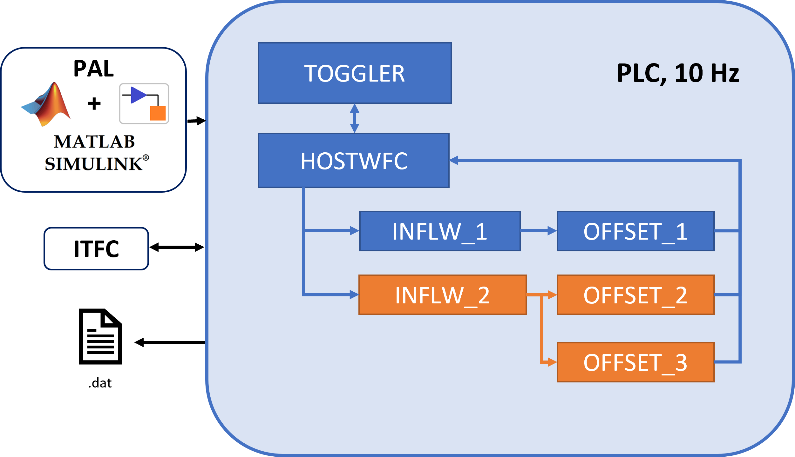

# WFC

## Introduction

The present repository contains a SImulink-based framework for the execution, monitoring and coordination of wind farm control strategies on a single wind turbine. The present models have been readapted and redacted. from those used during the wake steering campaign of the project compact wind 2 and developed by the Technical University of munich and the university of oldenburg. The main goal of the project campaign was to conduct  wake steering on a specific wind direction sector (plus the additional toggling with a greedy case). Two separate wake steering strategies were tested simultaneously, thus necessitating a shared platform for execution. a fixed offset toggling is also performed on a different wind direction sector. Simulink models for inflow determination, offset calculation and toggling were developed, which were then converted to C code and implemented on a programmable logic computer. The PLC was then connected to the turbine controller, reading inputs from the scada system and providing back the offseted signal, which was added to the wind turbine misalignment and fed to the wind turbine controller.

##  How to use this repository:

This repository is an extension of the framework for development, deployment and testing of interconnected PLC applications PAL (insert link). This repository contains a set of files and simulink models, which constitute PAL inputs that can be used to deploy a toggler for coordinating different wake steering strategies. For details on PAL setup, model development and how to develop a new project, please refer to the respective documentation. This repository should be placed as a submodule of PAL, which should be added in the \Examples folder of PAL.

## General Framework Architecture:
-------------------------------
Following the three layered approach of PAL, three layers have been included in the present framework for wind farm control, ITFC, HOST and SUBMODEL apps. In the experiment, the framework run on a Bachmann plc

An ITFC app, which during the experiments was developed by the wind turbine manufacturer, provided of all necessary data and the connection to the turbine controller was performed by the operator (who developed the "ITFC" app). This includes SCADA data, which were used to monitor the status of the turbines, but also data from a met-mast, which was located in the proximity of the turbines and was used to assess the inflow. The sampling frequency of the PLC system was 10 Hz. 

A HOST model is tasked with activities such as reading and writing data to and from ITFC applications, as well as hosting data for SUBMODEL access (both read and write), as well as generating the output .txt files.

As described in details in the PAL - User Manual (insert link), SUBMODEL applications perform all the higher level tasks, and are provided in the form of Simulink models. 

## Wake Steering Application

The submodels relative to wake steering are visible in Fig.~\ref{WFC-framework}, for an exemplary situation where two wake steering strategies are simultaneously tested. Each strategy is composed of two applications. The first, an "INFLW" app, determines the wind farm inflow. The second is a "WFC" app, which reads the inflow quantities and calculates the wind turbine offset. The main supervision task is performed by the "TOGGLER" application, which performs important tasks such as determining which strategy offset should be fed to the HOST (and therefore, to the turbine controller), according to a user-defined sequence. The "TOGGLER" also ensures that WFC is active only within prescribed inflow conditions. A thorough description of the wake steering applications will be provided in the full paper version.

The present framework was used to oversee wake steering experiments conducted on
a cluster of two 3.5 MW wind turbines. The experiments
aimed at assessing the performance of two strategies and were developed by two separate
research institutes. A further non-steered ”Greedy” case was also considered, which
provided a reference performance used for comparison. The toggling was performed on
the three strategies on a time interval of 35 minutes.

