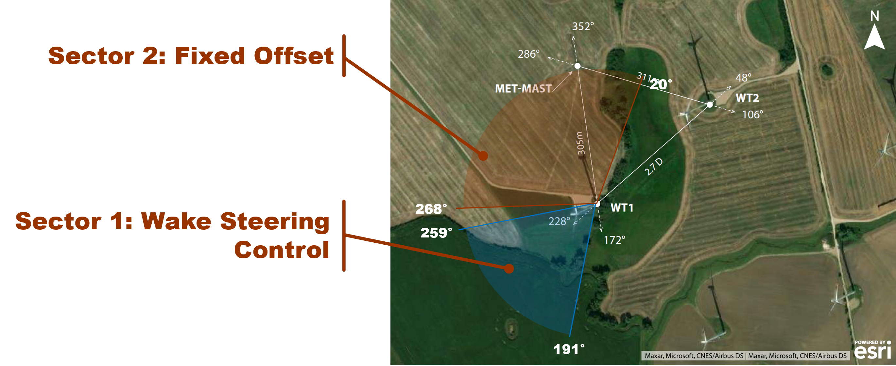

Introduction
===================

Introduction
============

This repository contains a Simulink-based framework designed for the execution, monitoring, and coordination of wake steering strategies on a wind turbine. Generalized to exclude any confidential information, the framework was utilized to coordinate two sets of experiments: one aimed at wind power maximization through wake steering, and the other at applying fixed offsets to a wind turbine for wake characterization using LiDARs. These experiments were conducted collaboratively by the Lehrstuhl für Windenergie at the Technische Universität München and the ForWind - Center for Wind Energy Research at the University of Oldenburg, within the federally-funded German project CompactWindII. The experimental site, located in northern Germany, comprises two wind turbines. An aerial view of the test site is provided in :numref:`overviewtestsite`.

   Aerial view of the test site

Wind direction and speed were measured by a met-mast located approximately 300m north of the turbine. This inflow data determined the wind direction sector and, subsequently, the offset calculation. This offset, combined with the misalignment provided by a wind vane sensor on the turbine nacelle, formed a signal that was then fed into the wind turbine controller. The offset calculation was performed by a programmable logic computer (*PLC*) installed at the base of WT1.

