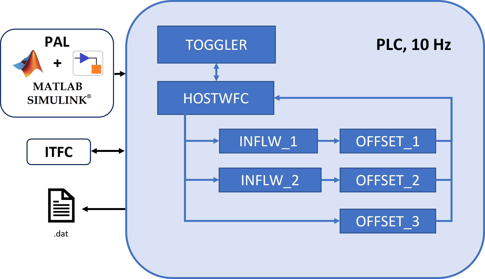
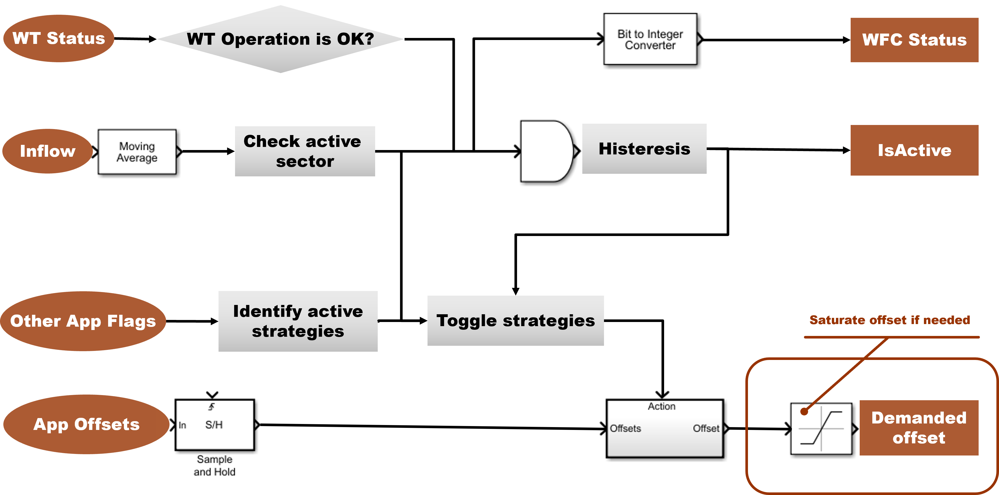

User Guide
===================================

General Framework Architecture
-----------------------------------

Adopting the three-layered approach of *PAL*, the current framework for wind farm control comprises *ITFC*, *HOST*, and *SUBMODEL* applications. In the conducted experiments, the framework was operated on a Bachmann *PLC* at 10 Hz.

During experiments, the *ITFC* app was developed by the wind turbine manufacturer and connected to the turbine controller. This app provided all necessary data for the framework execution. This includes *SCADA* data, which were used to monitor the status of the turbines, but also data from a met-mast, which was located in the proximity of the turbines and was used to assess the inflow.

The *HOST* model undertakes critical responsibilities, including exchanging data with *ITFC* applications, hosting data for *SUBMODEL* access (both read and write), and generating output ".txt" files.

As described in details in the `PAL Documentation <https://tumlwepal-rtd.readthedocs.io/en/latest/index.html>`_, *SUBMODEL* applications perform all the higher-level tasks and are provided in the form of *Simulink* models. A detailed description of the specific *SUBMODEL* apps and their operation is provided in the following section.

Each *PAL* project requires two Excel files as input: "*inputfile.xlsx*" and "*SVI_Definition.xlsx*." In consideration of potential storage issues on the *PLC* during testing, the repository includes an additional set of inputs labeled "test" alongside the default files. These test inputs are designed to facilitate focused testing of specific framework subsections, enabling the utilization of extended time histories for the test *ITFC*, thus limiting storage requirements.

Wake Steering Application
-------------------------

A comprehensive overview of the various *SUBMODELS* that constitute the framework is given below in :numref:`framework`. Each application type is detailed, providing a thorough understanding of their roles and interactions within the overall system.

   WFC Framework applications

**INFLW**

*INFLW* blocks determine inflow conditions based on available measurements. Their primary function is to provide inputs for offset determination within the *OFFSET* blocks. In the current setup, two identical Simulink models and **init_** files are supplied for both *INFLW* blocks (named with the appendix **_1** and **_2**), although in principle they can be customized to accommodate diverse design choices.

In this specific instance, wind speed inflow is measured at two different heights (116.3 and 54.2m), and used for the calculation of averaged wind speeds, turbulence intensity, and the shear exponent. Additionally, wind direction data is collected and averaged. Various moving averaging configurations for each inflow quantity can be specified through the appropriate **init_** file. The *Simulink* model incorporates checks to validate inputs, flag errors in case of frozen signals or NaN, and encodes the status of the *INFLW* block as a 4-bit signal. This signal is then converted to an integer and provided as an additional output through the variable "output_InflowOK."

**OFFSET**

*OFFSET* blocks are responsible for calculating offsets, which are subsequently fed to the *TOGGLER* app.

In the current example, three *OFFSET* blocks are included. Similarly to the *INFLW* apps, *OFFSET_1* and *OFFSET_2* are identical, reading inputs from *INFLW_1* and *INFLW_2*, respectively. These simple *Simulink* models interpolate a sample 4-dimensional LUT, but in principle they could incorporate more complex control techniques. Both offsets are toggled in sequence with a Greedy offset within "Sector 1". *OFFSET_3* provides a *Simulink* model for fixed offset calculation. It operates within "Sector 2" and does not require inputs.

Generally speaking, there is no strict need to separate *INFLW* from *OFFSET*, which could be incorporated in a single application. In the present case, this separation was implemented to enhance modularity and parallel development.

**TOGGLER**

The primary supervisory role is handled by the *TOGGLER* application, which executes tasks such as determining the strategy offset to be fed to the *HOST* (and consequently, to the turbine controller) based on a user-defined sequence and wind direction. The "TOGGLER" also ensures that the Wind Farm Control (WFC) is active only under prescribed inflow conditions, according to the active wind direction sector. A schematics of the TOGGLER application is shown in :numref:`toggler`.

   Building blocks of TOGGLER application

In general, the *TOGGLER* block reads its inputs from the *HOST*, similarly to any other *SUBMODEL*. The information about inflow characteristics from the met mast, averaged with a user-defined time windowing, is utilized to determine the active wind direction sector and assess whether wind conditions are suitable for offset provision. Simultaneously, the operational status of the wind turbine is monitored to ensure its power production. A variable "WFC_status" tracks the status of the toggling operations, akin to the "output_InflowOK" variable in the *INFLW* blocks.

A check is performed to confirm the availability of other applications within the PLC through the *AppStatus* variables of the other *SUBMODELS* (see PAL documentation for details). This ensures that offsets are selected only from active strategies. Manual toggling of strategies can be performed through both the **init_** file and at runtime using the dedicated flags. A further hysteresis block is added to prevent rapid switching on and off of the framework (which can happen, for example, when operating close to the wind directions or wind speed sector boundaries).

Toggling is performed on all available strategies of an active sector on a user-defined time schedule (in the present example it is set to 35 minutes). It is worth reminding that in the *Simulink* model included, an additional non-controlled "Greedy" was included as a reference, whose offset was set to zero.

Additional time-management functionalities are included, which can be used to prioritize strategies that have run less time than others. This functionality can be activated and defined through the **init** file.

Offsets from all *OFFSET* applications converge as inputs to the *TOGGLER* application, which selects the correct strategy based on the aforementioned checks.

The demanded offset can be further passed through a "Saturation block" (a "dummy" version is included in the present example), which can be used to perform additional processing on the signal. During the experiments of CompactWind2, for example, this block was built based on the wind turbine yaw controller to prevent involuntary shutdown during a sudden switch of wake steering strategy. Clipping of the yaw offset according to manufacturer requirements can also be applied, if necessary.

